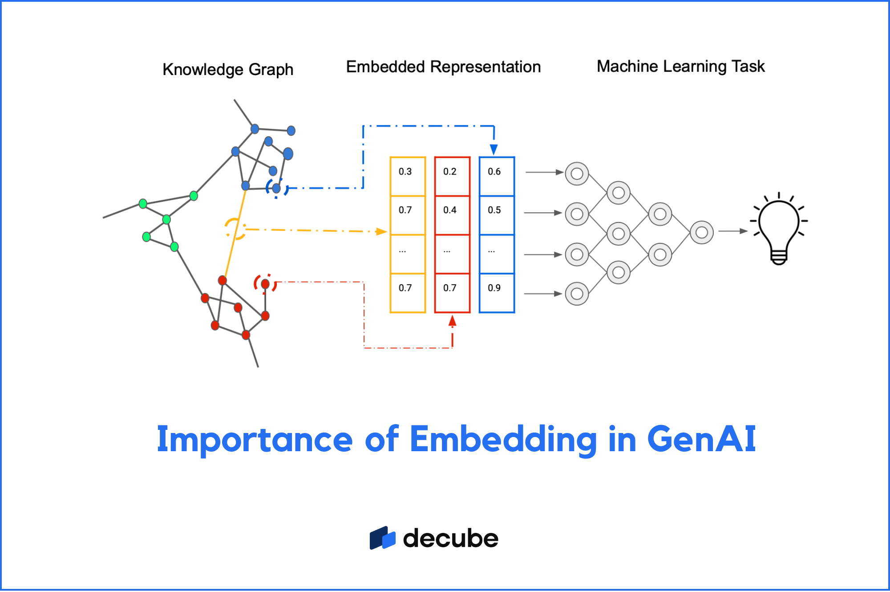
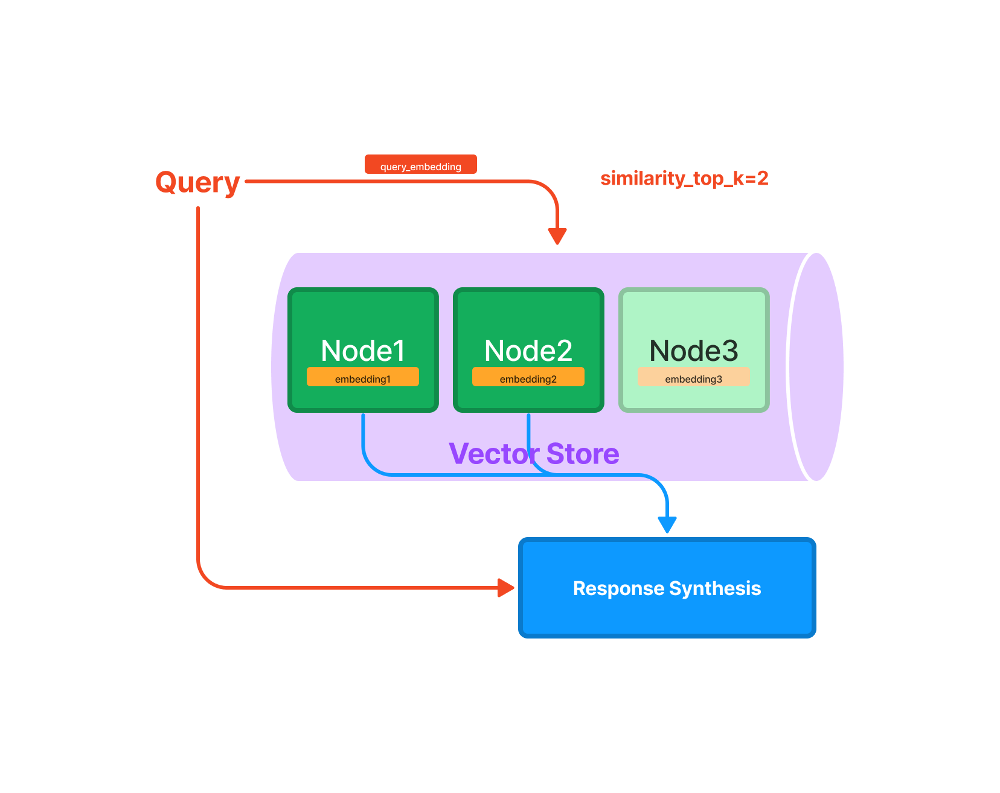

# RAGTool
This is an attempt to build an appliction that allows users to use RAG in addition to an LLM in order to quickly query and analyze PDFs and other documents.

## Introduction
RAG or Retrieval Augmented Generation is a model that uses a retriever to find relevant information and then uses a generator to generate a response. This is useful for finding information in large documents or databases or for summarizing information that an LLM may not have seen before. RAG has been shown to provide an excellent alternative to retraining LLMs on new data or even fine-tuning them.

**RAG Basics**

### Data Ingestion
The first thing we need to do is ingest our data. Using LLamaIndex we performed basic data ingestion with the `SimpleDirectorrReader` class. Once our document(s) were loaded we could then create our Index.

### Embedding Generation
Creating or deciding on an embedding model is a crucial step in the process. The embedding model is what is used to generate the embeddings for the documents. In our case, we used the `Alibaba-NLP/gte-Qwen2-1.5B-instruct` model. This model was chosen because it is a large model that has been trained on a variety of data and has been shown to perform well in a variety of tasks. This embedding model has 1.5 billion parameters and performs incredibly well without any additional node generation tequniques.

The Index is what is responsible for storing the embeddings of our documents. The following image shows the basic structure of generating embeddings.

**Embedding Basics**

As you can see, the knowledge graph has "groups" of data that are then used to generate embeddings. These embeddings are then stored in the Index. The Index itself can be stored in several different ways- LlamaIndex for example supports a plethora of storage options ranging from Open Source databases to cloud storage. And for each storage medium there a few options of index types ranging from storing embeddings in a vector, a graph, etc. 

Something to note about the colors found in the knowledge graph is that they represent the different "groupings" of data. These groups are known as Nodes and are created based on the embedding model or with advanced node generation techniques.

### Chuking/Node Generation
Above we talked about how embeddings are generated via the embedding model and the storage process of these embeddings be it local storage in a VectorStore or cloud storage in a GraphStore. Something we did not cover however is chunking/node generation. Generating nodes is incredibly important when it comes to RAG and can dictate how well your RAG application performs above all over factors. 

Generating nodes can be thought of as a means of "organizing" our ingested data. For example, if we ingest a series of manuals and proceed to create nodes, it would make logical sense to assign each book in the series its own node. Or perhaps we go further and assign each chapter within each book its own node. This can quickly turn into a messy process and as such requires some thought.

The default behavior in LlamaIndex is a default __chunking size__. This chunking size dictates how many tokens or rather words are put into each node. This is fixed value over the ingested data. This however does not make sense for almost all forms of data. Instead there are a few options for generating nodes and one of the more novel them are via __semantics__.

Semantic Node generation is just as it sounds. We create nodes based on the semantic similarity or "context" that is discussed. In our case we not only made use Semantic Node generation but what is known as __Double Merged Semantic Node Generation__. This novel node generation uses 3 paramters:
1. `initial_threshold` - the threshold for making a new chunk
2. `appending_threshold` - the threshold for appending a sentence to the previous chunk
3. `merging_threshold` - the threshold for merging two chunks together

It's known as double merge as we move through the data once making use of the `initial_threshold` and `appending_threshold` to generate our nodes and then we go over our newly created nodes once more using the `merging_threshold` to aggregate our highly similar nodes.

The more nodes we have the more broken down our data is. Each node is more highly related and hence data pulled from those nodes are very cohesive. Having too many nodes however can result in a loss of context and hence incomplete responses. A balance between the two are key!

### Vector Store Index
In our RAGTool, we made use of the LLamaIndex `VectorStoreIndex` class to store our embeddings, and also then stored the generated vectors to a director allowing us to quickly load the embeddings for use in our RAG model. Bellow is the general setup of the Vector Store.

**Vector Store** - Basic Storage of Nodes and their respective embeddings.


**Vector Store Query**
As you can see, when we query our RAG, we are querying the vector store for the embeddings of the documents we are interested in.


## Installation
Use the requirements.txt file to install the necessary packages.

```bash
pip install -r requirements.txt
```


## Usage
To run the application, use the following command:

```python
python main.py <embedding_model> <embedding_path> <document>
```

Where `<embedding_model>` is the name of the embedding model, `<embedding_path>` is the path to the persisted embedding model, and `<document>` is the path to the document you want to analyze.


## Sources
[LlamaIndex](https://docs.llamaindex.ai/en/stable/)
[HuggingFace](https://huggingface.co)
[MTEB LeaderBoard](https://huggingface.co/spaces/mteb/leaderboard)
[Embedding Model](https://huggingface.co/Alibaba-NLP/gte-Qwen2-1.5B-instruct)
[Semantic Double Merge Performance](https://bitpeak.com/chunking-methods-in-rag-methods-comparison/)