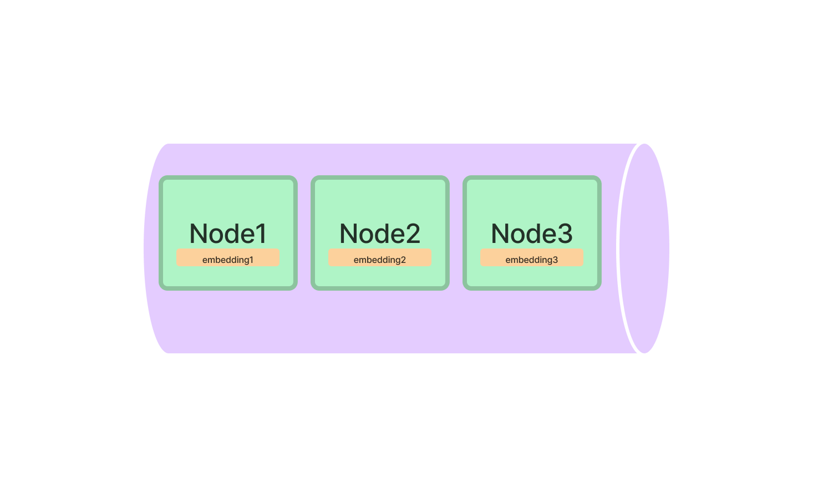

# RAGTool
This is an attempt to build an appliction that allows users to use RAG in addition to an LLM in order to quickly query and analyze PDFs and other documents.

## Introduction
RAG or Retrieval Augmented Generation is a model that uses a retriever to find relevant information and then uses a generator to generate a response. This is useful for finding information in large documents or databases or for summarizing information that an LLM may not have seen before. RAG has been shown to provide an excellent alternative to retraining LLMs on new data or even fine-tuning them.

**RAG Basics**

### Data Ingestion
The first thing we need to do is ingest our data. Using LLamaIndex we performed basic data ingestion with the `SimpleDirectorrReader` class. Once our document(s) were loaded we could then create our Index.

### Embedding Generation
Creating or deciding on an embedding model is a crucial step in the process. The embedding model is what is used to generate the embeddings for the documents. In our case, we used the `Alibaba-NLP/gte-Qwen2-1.5B-instruct` model. This model was chosen because it is a large model that has been trained on a variety of data and has been shown to perform well in a variety of tasks. This embedding model has 1.5 billion parameters and performs incredibly well without any additional node generation tequniques.

The Index is what is responsible for storing the embeddings of our documents. The following image shows the basic structure of generating embeddings.

**Embedding Basics**

As you can see, the knowledge graph has "groups" of data that are then used to generate embeddings. These embeddings are then stored in the Index. The Index itself can be stored in several different ways- LlamaIndex for example supports a plethora of storage options ranging from Open Source databases to cloud storage. And for each storage medium there a few options of index types ranging from storing embeddings in a vector, a graph, etc. 

Something to note about the colors found in the knowledge graph is that they represent the different "groupings" of data. These groups are known as Nodes and are created based on the embedding model or with advanced node generation techniques.

### Chuking/Node Generation
Above we talked about how embeddings are generated via the embedding model and the storage process of these embeddings be it local storage in a VectorStore or cloud storage in a GraphStore. Something we did not cover however is chunking/node generation. Generating nodes is incredibly important when it comes to RAG and can dictate how well your RAG application performs above all over factors. 

Generating nodes can be thought of as a means of "organizing" our ingested data. For example, if we ingest a series of manuals and proceed to create nodes, it would make logical sense to assign each book in the series its own node. Or perhaps we go further and assign each chapter within each book its own node. This can quickly turn into a messy process and as such requires some thought.

The default behavior in LlamaIndex is a default __chunking size__. This chunking size dictates how many tokens or rather words are put into each node. This is fixed value over the ingested data. This however does not make sense for almost all forms of data. Instead there are a few options for generating nodes and one of the more novel them are via __semantics__.

Semantic Node generation is just as it sounds. We create nodes based on the semantic similarity or "context" that is discussed. In our case we not only made use Semantic Node generation but what is known as __Double Merged Semantic Node Generation__. This novel node generation uses 3 paramters:
1. `initial_threshold` - the threshold for making a new chunk
2. `appending_threshold` - the threshold for appending a sentence to the previous chunk
3. `merging_threshold` - the threshold for merging two chunks together

It's known as double merge as we move through the data once making use of the `initial_threshold` and `appending_threshold` to generate our nodes and then we go over our newly created nodes once more using the `merging_threshold` to aggregate our highly similar nodes.

The more nodes we have the more broken down our data is. Each node is more highly related and hence data pulled from those nodes are very cohesive. Having too many nodes however can result in a loss of context and hence incomplete responses. A balance between the two are key!

### Vector Store Index
In our RAGTool, we made use of the LLamaIndex `VectorStoreIndex` class to store our embeddings, and also then stored the generated vectors to a director allowing us to quickly load the embeddings for use in our RAG model. Bellow is the general setup of the Vector Store.

**Vector Store** - Basic Storage of Nodes and their respective embeddings.


**Vector Store Query**
As you can see, when we query our RAG, we are querying the vector store for the embeddings of the documents we are interested in.

**Testing and Outputs**
For testing, the `Alibaba-NLP/gte-Qwen2-1.5B-instruct` embedding model was used as it has very strong embedding understanding resulting in incredibly robust overall embeddings. Additionally, the use of double pass merged semantics were used to create a better overall picture of our embeddings. Recall that this creates semantically cohesive nodes for our embeddings resulting in better retrieval. Lastly, the LLM model used was Microsoft's `Phi-3-mini-4k` model. This model is fully open source for commercial and personal use and developed my Microsoft- of course. 

Some testing was done with the LLM and its outputs for the IEEE research paper. Please note that the outputs are only on the text from the paper and not the graphs- a RAG system like that would require a multi-modal LLM. The testings are formatted as a __question__ on the top line followed by the __answer__ below it.

1. What is one-bit quantization and how does it relate to SNR?

```text
One-bit quantization refers to a specific type of digital signal processing where each sample of an analog signal is converted into either a binary '0' or a binary '1'. This process is also known as hard thresholding, because there are no intermediate values; the signal amplitude is categorized strictly into two states. Here's how one-bit quantization relates to Signal-to-Noise Ratio (SNR):

The SNR in digital systems measures the ratio between the desired signal power and the noise introduced by the system, typically expressed in decibels (dB). In a one-bit quantization scenario, since there are only two possible output values for each input sample, this process inherently introduces some level of quantization error or distortion.

This quantization error is essentially an additional noise source that comes from the limited precision in representing analog signals digitally. The SNR after one-bit quantization can be calculated using a specific formula:

SNR = 1.5 * (Q^2) + 10*log10(1/k),

where Q is the amplitude resolution (quantization step size in this case, which is the full range of the input signal divided by one less than the number of quantized levels) and k is the number of bits used for quantizing. In a one-bit system, k equals 1, leading to:

SNR = 1.5 * Q^2 + 10*log10(1/1).

It's worth noting that since there are no intermediate values in one-bit quantization, the SNR can be significantly affected by the dynamic range of the input signal and the precision needed to capture it without excessive noise. In general, a higher quantizer resolution (more bits) will result in better SNR because it reduces the impact of quantization error on the overall system performance. However, for certain applications where simplicity or hardware limitations necessitate one-bit representation, understanding this trade-off between reduced complexity and potential degradation in signal quality is crucial.

The provided document also mentions a "14-bit" quantization (a) which contrasts with the "one-bit quantization" described above. The 14-bit quantization would imply higher precision, thus potentially offering better SNR due to lesser quantization noise as compared to one-bit quantization. However, this particular concept is not elaborated in the provided document but can be inferred from general knowledge on digital signal processing and quantization techniques.
```

2. Tell me more about potential degradation in signal quality.

```text
When discussing the potential degradation in signal quality due to one-bit quantization or higher bit quantization, several key factors come into play:

1. Quantization Error: One-bit quantization inherently introduces a high level of quantization error since it only offers two possible output values (0 and 1). This leads to significant information loss in the signal's original amplitude representation. The resulting quantization noise can degrade the quality of reconstructed signals, causing distortion and reducing fidelity.

2. Loss of Information: With one-bit quantization, each sample is either a '0' or a '1,' effectively losing all the subtle variations in amplitude present in the original analog signal. This loss can be particularly detrimental for signals with high dynamic range (large differences between their minimum and maximum values), as it may cause clipping of small yet essential details.

3. Bit Depth: The number of bits used to represent an analog input, commonly referred to as bit depth, has a direct impact on signal quality. Higher bit depths allow for more precise quantization, reducing the error introduced during quantization and improving overall SNR. For example, 16-bit or 24-bit systems are often used in professional audio recording due to their improved fidelity compared to lower bit-depth formats like one-bit quantization.

4. Signal-to-Noise Ratio (SNR): A key performance metric that measures the quality of a digital signal relative to its background noise is SNR. The higher the number of bits used in quantization, the better the SNR, as it implies less quantization error and lower overall system noise level. One-bit quantization generally results in poorer SNR due to high levels of quantization distortion.

5. Bit Rate: In digital communication systems, using more bits per symbol (i.e., increasing the bit rate) can improve signal quality by allowing for finer granularity and reducing errors during transmission. However, this often comes at the cost of increased bandwidth requirements and potentially higher power consumption.

6. Quantization Noise Shaping: In some advanced digital systems, techniques such as noise shaping or dithering are employed to improve signal quality by intentionally adding low-level random noise (dither) during quantization. This can help spread the quantization error energy across a broader frequency range, potentially making it less perceptible and preserving the overall integrity of the reconstructed signal.

In summary, potential degradation in signal quality due to one-bit or lower bit quantization arises primarily from the significant information loss associated with limited representation capabilities. As such, higher bit depths are generally preferred when aiming for high-quality digital representations and reproductions of analog signals. The choice between different quantization strategies depends on various factors, including system requirements, available hardware resources, and acceptable levels of signal fidelity.
```

3. Can you talk about point 2 some more?

```text
Certainly! In the context of one-bit quantization and its impact on signal quality, we can delve deeper into the concept of loss of information (point 2). When a continuous analog signal is converted to digital form through quantization, each sample's amplitude must be rounded off or truncated to fit within discrete levels. The consequence of this process is that certain details present in the original signal become indistinguishable due to their representation by a single binary value ('0' or '1').

Here are some additional aspects related to loss of information with one-bit quantization:

1. Lossy Compression: One-bit quantization is essentially equivalent to a lossy compression technique, where the original signal is compressed to an extremely small size by discarding most of its information content. Although this approach may be useful in specific applications that prioritize simplicity and low storage requirements over high fidelity (e.g., certain types of image or sound synthesis), it's important to recognize that valuable details are sacrificed during the process.

2. Lossy Signal Reconstruction: When a one-bit quantized signal is reconstructed back into its analog form, there is no way to recover the exact original waveform due to the loss of information. This means that even if we have access to multiple samples from the same source, it's impossible for us to determine whether they were obtained directly or through one-bit quantization.

3. Nonlinear Distortion: Since one-bit quantization does not preserve linear relationships between input and output amplitudes, nonlinear distortions can occur during signal reconstruction (e.g., clipping of the signal). Such distortions further degrade signal quality by introducing additional unwanted artifacts that were not present in the original analog signal.

4. Limited Dynamic Range: One-bit quantization severely limits the dynamic range—the difference between the smallest and largest values a system can represent—of digital signals. For high dynamic range applications, this limitation could lead to clipping of small but important details in both loud and quiet portions of an audio recording or signal, resulting in significant distortion.

5. Impact on SNR: As mentioned earlier, one-bit quantization has a direct impact on the Signal-to-Noise Ratio (SNR) of the reconstructed signal due to high levels of quantization noise introduced by rounding off or truncating analog signal samples. While this can be useful in certain applications that prioritize simplicity and low storage requirements, it's crucial to consider the tradeoff between reduced information content and compromised quality when evaluating its suitability for specific tasks.

In summary, one-bit quantization offers limited bit depth, leading to a significant loss of information and potential degradation in signal quality due to nonlinear distortions, clipping artifacts, restricted dynamic range, and reduced SNR. Therefore, it's important to carefully consider the specific application requirements when choosing an appropriate quantization scheme for digital signal processing tasks.
```


## Installation
Use the requirements.txt file to install the necessary packages.

```bash
pip install -r requirements.txt
```


## Usage
To run the application, use the following command:

```python
python main.py <embedding_model> <embedding_path> <document>
```

Where `<embedding_model>` is the name of the embedding model, `<embedding_path>` is the path to the persisted embedding model, and `<document>` is the path to the document you want to analyze.


## Sources
[LlamaIndex](https://docs.llamaindex.ai/en/stable/)
[HuggingFace](https://huggingface.co)
[MTEB LeaderBoard](https://huggingface.co/spaces/mteb/leaderboard)
[Embedding Model](https://huggingface.co/Alibaba-NLP/gte-Qwen2-1.5B-instruct)
[Semantic Double Merge Performance](https://bitpeak.com/chunking-methods-in-rag-methods-comparison/)